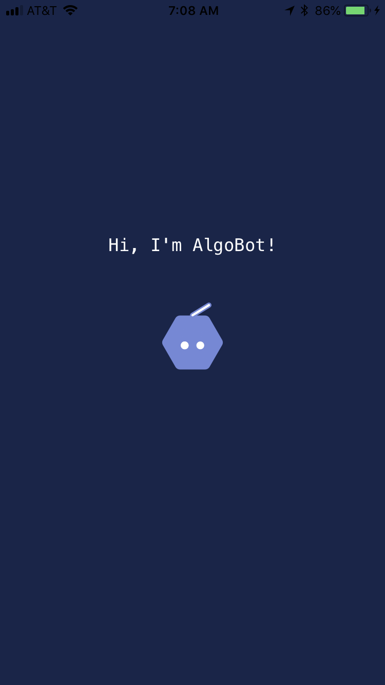
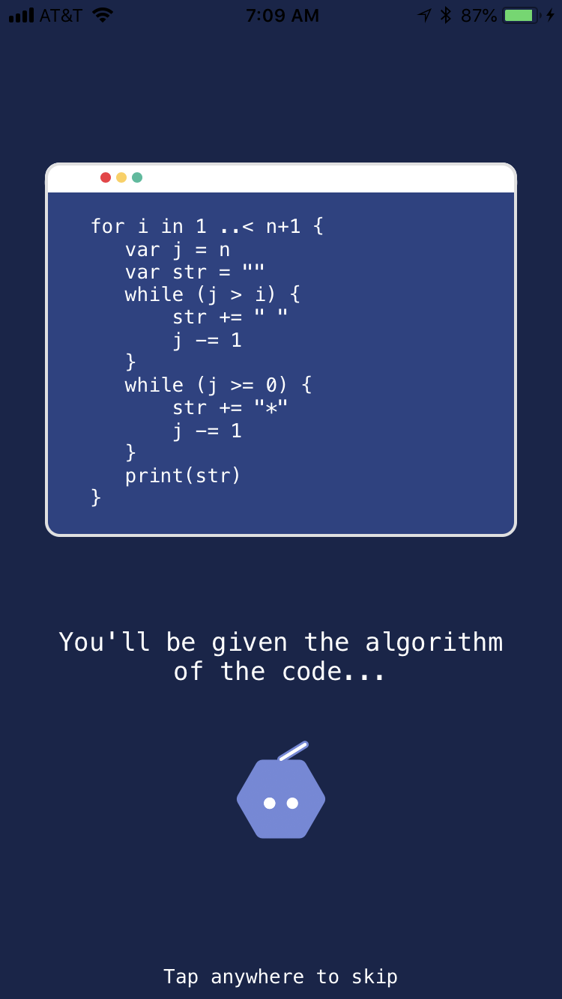
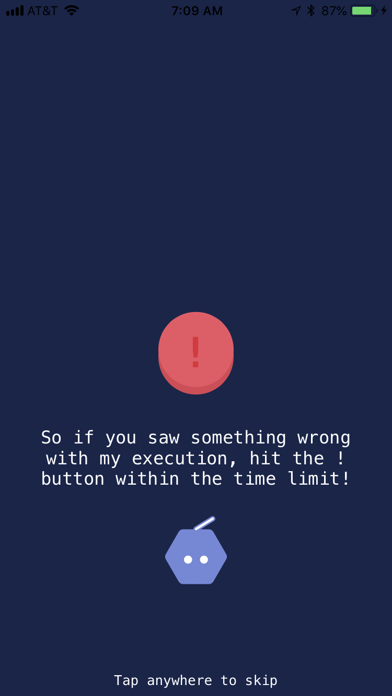
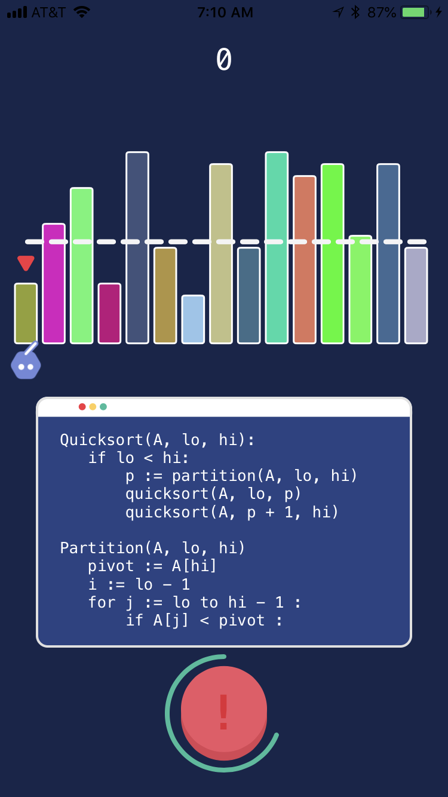
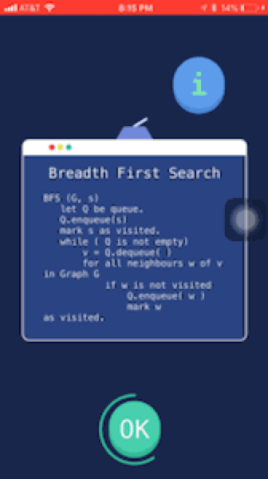

# Algobot

This project was extended from Swift Playground, a WWDC 2018 Scholarship submission.

## Inspiration & Function
This project was inspired by the act of my friends practicing their programming skill through online coding practice platform such as LeetCode and HackerRank. I noticed that my friends sometimes take a long time in trying to understand the process of the code, and visualization of the code is one of the method they used to understand the process behind those codes. As such, Algobot was created to help programming learners in understanding code process and outcomes.

The player will be first given the algorithm of the code, and then when the player enters the game, the player has to "supervise" the bot in tracing the code based on the algorithm given. The player has to make sure the bot does not perform wrong steps while the bot visualizes the algorithm.

## How does it works

First off, an algorithm will be shown to user and user can go through the algorithm for a certain amoung of seconds.

If user noticed that the bot goes "haywire" - as in the bot does not follow the algorithm flow, the user has to press the exclamation button to notify the bot.

Some of the algorithm used in the game:

### Insertion Sort

### Quick Sort

### Breadth First Search

### Some Random Tracing Algorithm

And also Dijkstra's, DFS, and more soon!

## What I have learnt
Thanks to Swift's enum abilities, I was able to build an efficient Quad Tree algorithm that leads to an efficient implementation of force directed graph (for algorithms like BFS, DFS, and Dijkstra's algorithm)

## Improvements
First off, there can be a pointer to a certain line of code that shows what line the bot is executing.
